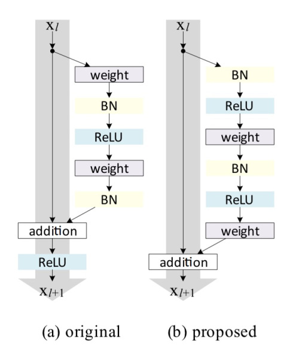

# Residual Network (ResNet) - Tensorflow

This network is implemented based on the [Identity Mappings in Deep Residual Networks](https://arxiv.org/pdf/1603.05027.pdf).

The ResNet is neural network architecture which solves the Venishing gradient problem. The goal of ResUnits is to make 'shorcuts' for gradients flowing backwards through the network.

In my implementation I've used this version of ResUnit (version b):

In this code I've used Conv layer as 'weight' part of the ResUnit. It could be changed to Fully Connected version, easily. BN = Batch normalization.

The image for Batch Normalization.

## Install

### &nbsp;&nbsp;&nbsp; Python version
&nbsp;&nbsp;&nbsp;&nbsp;&nbsp;&nbsp;&nbsp;&nbsp;&nbsp;- Python version used in this project: 3.5+

### &nbsp;&nbsp;&nbsp; Dependencies

> *  [TensorFlow](http://tensorflow.org) 1.2.0
> *  [Numpy](http://www.numpy.org) 1.10.4
> *  [Time]()

### Code

The code for this project is inside **ResNet_python.ipynb**.

### How to run

To run this project execute one of these two lines in your terminal/cmd:

`ipython notebook ResNet_python.ipynb`

or

`jupyter notebook ResNet_python.ipynb`

### Read more about Highway network

[Identity Mappings in Deep Residual Networks](https://arxiv.org/pdf/1603.05027.pdf)

## License

MIT License

Copyright (c) 2017 Luka Anicin

Permission is hereby granted, free of charge, to any person obtaining a copy
of this software and associated documentation files (the "Software"), to deal
in the Software without restriction, including without limitation the rights
to use, copy, modify, merge, publish, distribute, sublicense, and/or sell
copies of the Software, and to permit persons to whom the Software is
furnished to do so, subject to the following conditions:

The above copyright notice and this permission notice shall be included in all
copies or substantial portions of the Software.

THE SOFTWARE IS PROVIDED "AS IS", WITHOUT WARRANTY OF ANY KIND, EXPRESS OR
IMPLIED, INCLUDING BUT NOT LIMITED TO THE WARRANTIES OF MERCHANTABILITY,
FITNESS FOR A PARTICULAR PURPOSE AND NONINFRINGEMENT. IN NO EVENT SHALL THE
AUTHORS OR COPYRIGHT HOLDERS BE LIABLE FOR ANY CLAIM, DAMAGES OR OTHER
LIABILITY, WHETHER IN AN ACTION OF CONTRACT, TORT OR OTHERWISE, ARISING FROM,
OUT OF OR IN CONNECTION WITH THE SOFTWARE OR THE USE OR OTHER DEALINGS IN THE
SOFTWARE.
